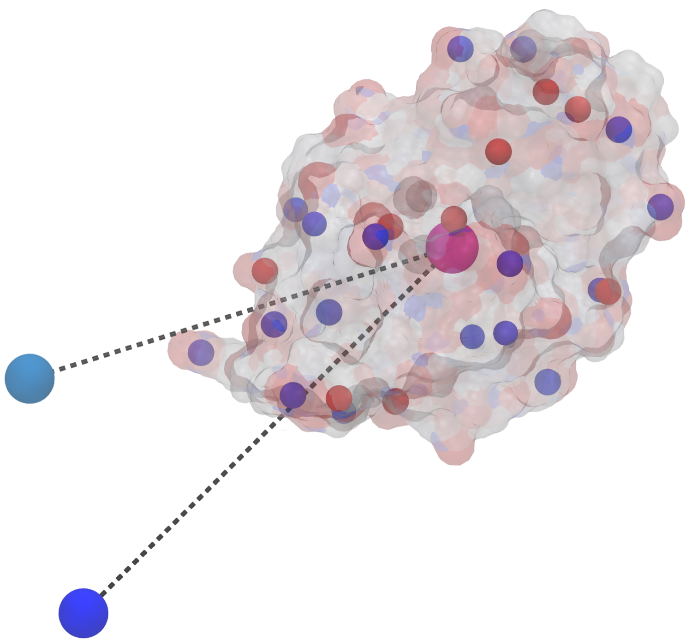

# proteinDipole
Tool for calculating protein dipole moments at a given pH. Input file can be a .pdb or a .pqr outputted from the PDB2PQR server of the sole protein for which the dipole is required.

Dipole vectors are calculated using the following equation:<br/> 

)

where the vectors between the position of a point and the protein centre of mass, multiplied by the charge on the point, are all summed. The dipole moment is then just the magnitude of the dipole vector, given as the distance between the protein centre of mass and the dipole vector.  

<!--

Please feel free to use and edit this tool as you wish and cite the paper below if this tool has at all been useful:

[Title](link).

-->

Example: 
```
python proteinDipole.py -f input.file -pH 3
``` 

**Note:** If a .pdb file is used, the charges on protien residue side-chains are calculated using standard amino acid pKas. If a .pqr file is used, then the dipole moment for charges using standard pKas and charges from the .pqr files are outputted separately for comparison. 


```
requirements: python3, numpy
usage: proteinDipole.py [-h]

Tool for calculating the dipole moment of proteins at a given pH. 
Example:
python proteinDipole.py --fileName file.pdb --pH 7

optional arguments:
  -h, --help            show this help message and exit
  -f FILENAME, --fileName FILENAME
                        input pdb list file name (default: file.pdb)
  -pH PH, --pH PH       input pH (default: 7)
```


Output file:
A XXX_dipole.pdb file, where XXX is the input file name, containing coordinates for charged atoms on side chains and dipoles calculated from the tool. The following teminology is used to describe the dipole values calculated:
  -STD: Dipole calculation using charges from the standard pKa of amino acids.
  -PQR: Dipole calculation using charges outputted in the .pqr file.
  -DV: Dipole vector of the protein.
  -DN: Normalised dipole vector of the protein.
  -DM: Dipole moment of the protein.

Finally, the charges on atoms and dipole vectors can be viewed in visualisation tools such as [VMD](https://www.ks.uiuc.edu/Research/vmd/). An example of a VMD visualisation state (lysozyme_example.vmd) is available in in the example directory.

<p align="center">

</p>

The transparent protein surface is coloured by surface charges from the .pqr file, while point charges on protein calculated using standard pKas are shown as the smaller, opaque spheres. Positive charges are blue, negative charges are red. The centre of mass on the protein is represented by the larger, magenta sphere and the dipole vectors calculated from a .pqr and standard pKas are represented by dashed lines ending in larger cyan and blue spheres respectively.
